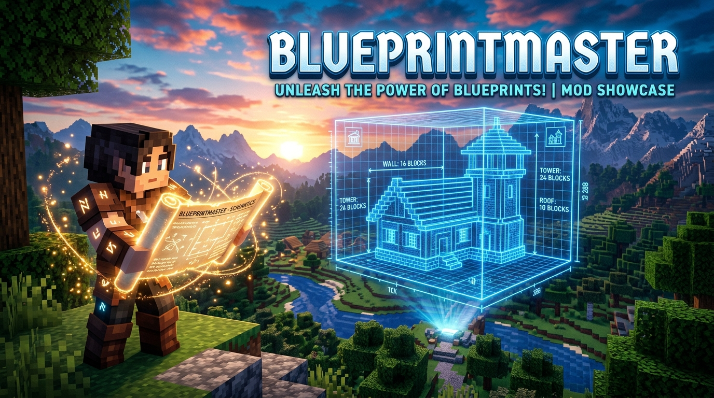

# 🏗️ BlueprintMaster — The Ultimate Builder's Hologram Suite 📐✨

  

  

    
    
    
    
  

---

**The modern, lightweight, and ban-safe 3D holographic structure planning suite for Minecraft (1.20 – 26.3 Snapshots) on Fabric & NeoForge!**

---

## 🆕 What's New in 26.3 / Latest Update (v1.1.0)

- **26.3 & 26.3-snapshot Support**: Full rendering support for 3D holographic structure blueprints in Minecraft 26.3 snapshot.
- **Improved HUD Shopping Calculator**: Real-time accurate block inventory counts.
- **Lunar Client Compatibility**: Smooth 60 FPS ghost rendering on Lunar Client and vanilla Fabric.

---

## 📥 Downloads & Links

- **Modrinth Downloads**: [BlueprintMaster on Modrinth](https://modrinth.com/mod/blueprintmaster)
- **Source Code**: [Krylo-60 / BlueprintMaster GitHub](https://github.com/Krylo-60/BlueprintMaster)

---

## ⚡ Features

### 👻 3D Translucent Ghost Hologram Projection
- Projects a floating 3D holographic wireframe of your building directly in your world.
- Place blocks directly into the ghost outline with visual grid alignment!

### 📋 Automatic Material Shopping List (`M`)
- Press **`M`** at any time to open your live bill of materials:
  - 🟢 **Available in Inventory** (Green checkmark)
  - 🔴 **Missing Items** (Red count with exact quantities needed)

### 🏡 Built-in Starter Architecture Library (`P`)
- Includes pre-loaded architectural presets:
  - 🏠 **Cozy Survival Cottage** (7x5x7 Starter timber house)
  - 🌾 **Compact Auto-Crop Farm** (9x3x9 Automated water farm)
  - 🗼 **Nether Portal Ancient Shrine** (Obsidian & gilded altar)
  - 🛡️ **Medieval Defense Watchtower** (5x9x5 Stone outpost)

### 🔄 1-Click Rotate & Nudge
- Rotate blueprints 90° around their vertical axis with 1 click.
- Nudge coordinates up, down, left, and right to align with your terrain.

### 🛡️ Smart Multiplayer Fair-Play Protection
- 🟢 **Singleplayer Solo Mode**: Easy-Build assist enabled for solo building.
- 🔒 **Multiplayer Servers**: Auto-placement is **hard-locked and disabled**. Players receive 100% ban-safe client-side holograms and material lists only!

---

## ⌨️ Default Controls

| Keybind | Action | Description |
| :--- | :--- | :--- |
| **`P`** | **Blueprint Planner Menu** | Open preset selector, rotation, and placement controls |
| **`M`** | **Material List** | Toggle the live required materials shopping list HUD |
| **`H`** | **Toggle Hologram** | Toggle 3D hologram projection ON / OFF |

---

## 🎮 Supported Loaders & Minecraft Versions

| Platform | Supported Versions | Status |
| :--- | :---: | :---: |
| 🟢 **Fabric & Quilt** | **1.20 – 26.3 Snapshots** | ✅ Full Support |
| 🟠 **NeoForge & Forge** | **1.20 – 26.3 Snapshots** | ✅ Full Support |

---

## 📜 Authors & Open Source License
- **Creator & Maintainer**: [Krylo_plays](https://github.com/Krylo-60)
- **Organization**: [Krishiv Studios](https://github.com/KrishivStudios)
- **License**: [GNU General Public License v3.0 (GPL-3.0)](LICENSE)
